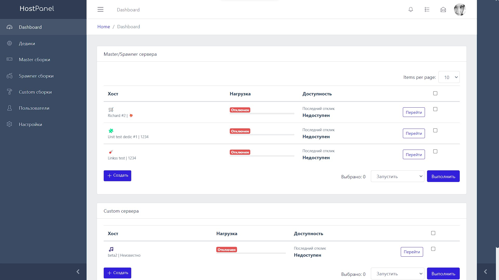
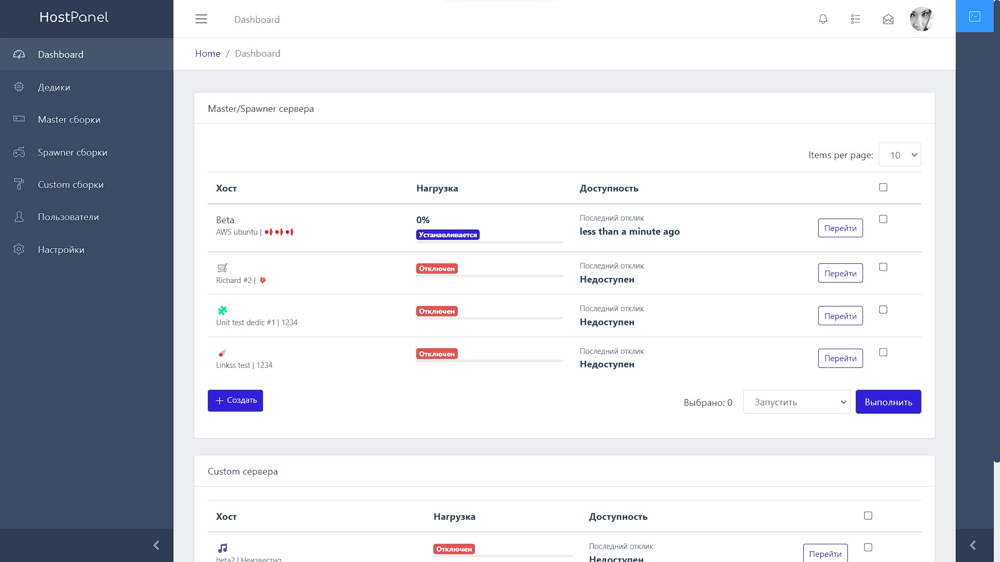
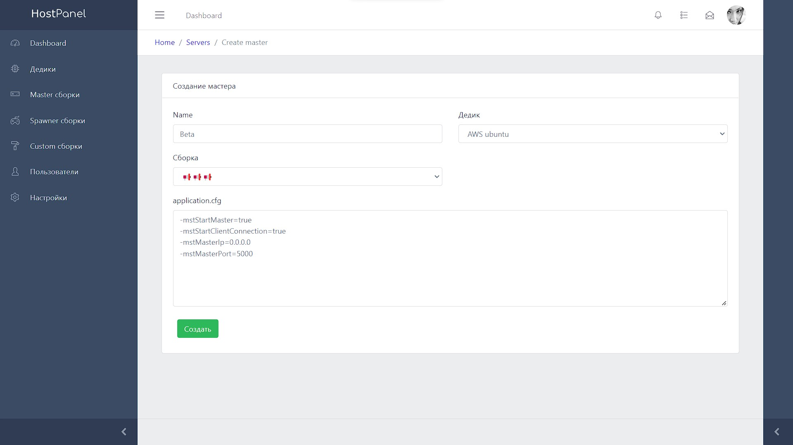
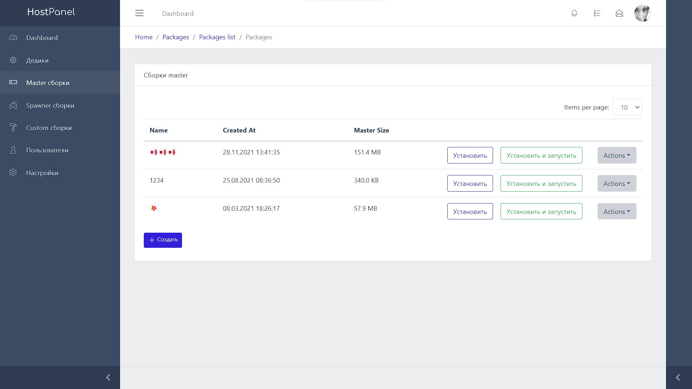
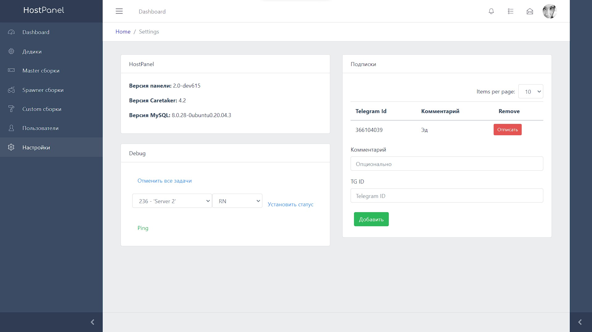

# HostPanel
HostPanel - панель управления игровыми серверами MST (Master Server tools).
Используется для управления игровыми серверами Unity.

Панель состоит из 3 частей:

Бэк: Django

Фронт: Vue

Микросервис: Flask
## Скриншоты

